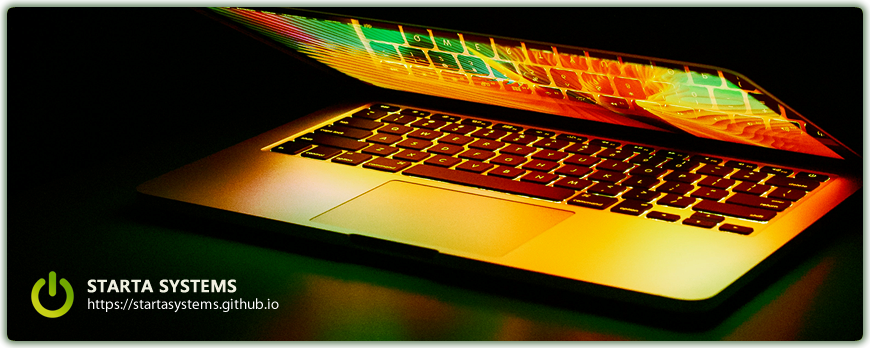

# Olá, seja bem-vindo(a) 👋

Uma equipe formada por profissionais com mais de 20 anos de experiência em diferentes segmentos de mercado, oferecemos diferentes soluções para o desenvolvimento de softwares, aplicativos para smartphones, tablets e smarttvs de diferentes plataformas tecnológicas como [PWA](https://developers.google.com/web/progressive-web-apps/), [Design de Interfaces (UI)](https://en.wikipedia.org/wiki/User_interface_design), [Design de Experiência do Usuário (UX)](https://en.wikipedia.org/wiki/User_experience), [Blockchain](https://en.wikipedia.org/wiki/Blockchain), [Contratos Inteligentes](https://en.wikipedia.org/wiki/Smart_contract) e mais...

Desenvolvemos produtos e serviços personalizados de acordo com as necessidades e estratégias de cada cliente. Nossa principal responsabilidade é transformar a força da [sua marca](https://en.wikipedia.org/wiki/Brand) com nossa [expertise em uma interface de produto única](https://en.wikipedia.org/wiki/Product_intelligence), que aprimore e unifique a experiência do usuário em diferentes plataformas.

## 🍿 Github: Uma comunidade imparável

Decidimos construir a Starta Systems no GitHub. Na verdade, fazemos isso desde **meados de 2016**. Mas infelizmente ainda não podemos nos dedicar em tempo integral nesse sonho. Por isso imaginamos que o desenvolvimento de nossos projetos seja um pouco lento no começo, já que temos nossos próprios empregos formais em grandes big techs. Mas o que nos motiva é essa possibilidade de trabalhar em nossos próprios projetos, inspirados e patrocinados por nossa comunidade a desenvolver softwares únicos!

Por isso acreditamos que uma comunidade de código aberto é fundamental para a construção de nossos software hoje. Nossa equipe é pequena e distribuída pelo Brasil no momento, [mas estamos sempre abertos a receber novos membros](../CONTRIBUTING_PT-BR.md).

## Traduções

[Inglês](https://github.com/startasystems)
